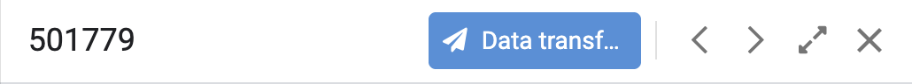

# Schéma explicatif de Combinations dans appsheet

# Vue Combinations dans appsheet

~~~ javascript
AND(
  IN(
    CONCATENATE(USERSETTINGS("Email"), "-", USERSETTINGS("Code"), "-", USERSETTINGS("Sprache")),
    Userlist[Email-Code-Lang]
  ),
  ISNOTBLANK([Order Number]),
  ISNOTBLANK([Designation]),
  NOT(IN([Chargen - Status], LIST("L93", "L96")))
)
~~~

1. L'utilisateur est autorisé :  
    Il concatène son Email, Code, et Langue (paramètres utilisateur),  
    puis vérifie que cette combinaison existe dans la table Userlist`[Email-Code-Lang]`.
2. Le champ `[Order Number]` n’est pas vide. 
    
3. Le champ `[Designation]` n’est pas vide.
    
4. Le champ `[Chargen - Status]` n’est pas égal à "L93" ou "L96".

 On peut également voir leurs [[Statut]] (sold, reserved, ect...)

## Description d'une machine Combinations

On peut aussi avoir le descriptif d'une machine en cliquant dessus

On à donc:
- La charge 
- Le numéro de référence
- Son nom
- Ses caractéristiques ou équipement (Roller / Outer discs / ect..)
- Son status à nouveau
- La date de production de la machine
- Son prix
- Et le lieu de location

Nous avons également un bandeau en haut de la description

On y retrouve:
- La charge (501779)
- [data transfer](datatransferlemken)
- Un bouton pour aller au cultivateur précédent
- Un autre bouton pour aller au cultivateur suivant
- Un bouton pour agrandir la description 
- Et enfin un bouton pour fermer la description

La méthode pour faire un lien c'est de mettre *[le nom que tu veux donner](le nom du fichier que tu veux atteindre.md)*

Ce qui donne:

[Cultivator](Cultivator.md)

