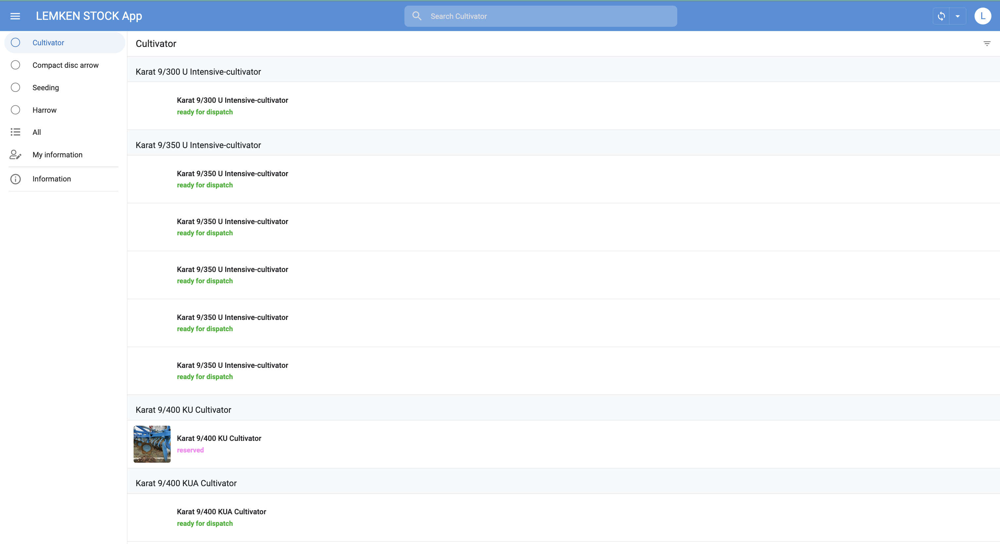
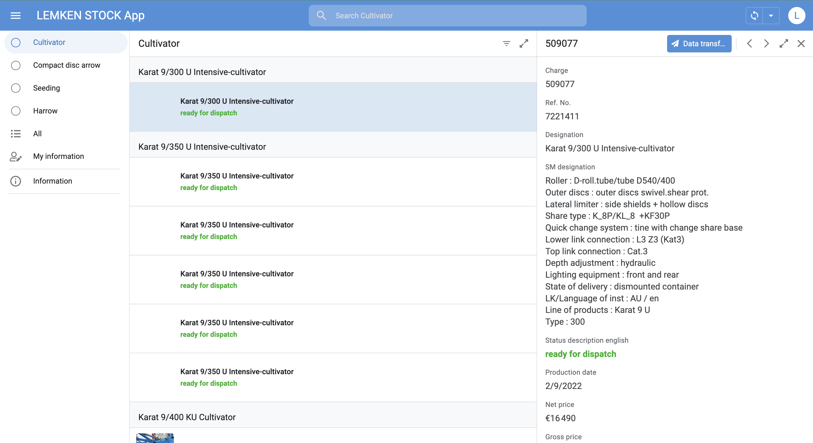
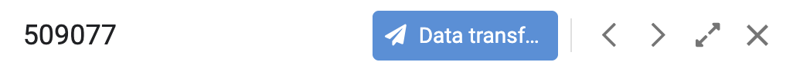

# Schéma explicatif de Cultivator dans appsheet
![[Schemachemincultivator.png]]

# Vue Cultivator dans appsheet
![[pagedaccueilphoto.png]]

~~~ javascript
AND(
    IN(
        CONCATENATE(USERSETTINGS(Email), "-", USERSETTINGS(Code), "-", USERSETTINGS(Sprache)),
        Userlist[Email-Code-Lang]
    ),
    OR(
        CONTAINS([Designation], "karat"),
        CONTAINS([Designation], "koralin"),
        CONTAINS([Designation], "kristall")
    ),
    NOT(IN([Chargen - Status], LIST("L93", "L96")))
)
~~~

Cette expression permet d’activer une action ou un affichage uniquement pour certains utilisateurs autorisés, lorsqu’ils travaillent sur des articles spécifiques (contenant "karat", "koralin" ou "kristall"), et que le statut de la charge n’est pas terminé ou verrouillé (statuts "L93" ou "L96").

On peut également voir leurs [[Statut]] (sold, reserved, ect...)
 

## Description d'une machine Cultivator

On à donc:
- La charge
- Le numéro de référence
- Son nom
- Ses caractéristiques ou équipement (Roller / Outer discs / ect..)
- Son status à nouveau
- La date de production de la machine
- Son prix
- Et le lieu de location

Cette liste correspond à la table Google sheets Bestandslist Aktuel.

Nous avons également un bandeau en haut de la description

On y retrouve:
- La charge (509077)
- [[data transfer (lemken)]] (transfert de donnée) 
- Un bouton pour aller au cultivateur précédent (réalisé par Appsheet)
- Un autre bouton pour aller au cultivateur suivant (réalisé par Appsheet)
- Un bouton pour [[agrandir]] la description (réalisé par Appsheet)
- Et enfin un bouton pour fermer la description (réalisé par Appsheet)

