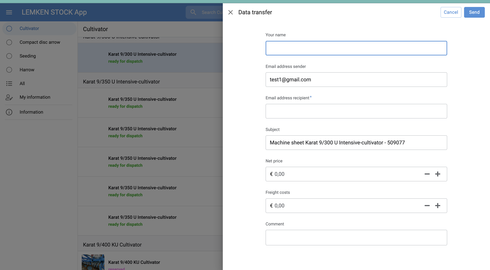

Ce menu sert à envoyer une machine par mail.
# <u>Ici on peut voir que l'on a différent champs que l'on peut remplir:</u>

- Your name (votre nom)
- Email address sender (adresse de la personne qui envoie)
- Email address recipient (adresse de la personne qui reçoit)
- Net price (prix net)
- Freight cost (coût de frais)
- Comment (commentaire)

## <u>Code pour le nom</u>
~~~
IF(USERSETTINGS(Sprache) = "Englisch", "Your name", 
IF(USERSETTINGS(Sprache) = "Deutsch", "Ihr Name", "Your name"))
~~~
## <u>Code pour Email address sender </u>
~~~
USERSETTINGS(Email)
~~~

Cette expression permet de **récupérer l’adresse e-mail choisie par l’utilisateur** dans les paramètres de l’application.  

## <u>Code pour la date de production</u>

~~~
TEXT ([Machine].[Production date / Produktions datum], "MM/YYYY")
~~~

Cette expression affiche le mois et l’année de production de la machine associée, au format "MM/YYYY", sous forme de texte.  
Elle est utile pour regrouper, afficher ou comparer les dates à un niveau mensuel.
### <u> Code pour le prix net (allemand ou anglais)</u>

~~~
IF(USERSETTINGS(Sprache) = "Englisch", "Net price", 
IF(USERSETTINGS(Sprache) = "Deutsch", "Nettopreis", "Net price"))
~~~

Cette expression affiche **le libellé du prix net dans la bonne langue** selon ce que l’utilisateur a choisi dans les paramètres de langue.  
Cela permet d’avoir une interface **multilingue** (ici **allemand/anglais**, avec l’anglais comme valeur par défaut).
# <u>Code pour le transfert de photos</u>

~~~
IF(ISNOTBLANK([Machine].[Photo 1]), "Photos:","")
~~~

Cette expression affiche **le mot "Photos:" uniquement si une photo a été ajoutée** dans la colonne `[Photo 1]` de la machine associée.  
Elle est utile pour **structurer dynamiquement l’affichage** d’un champ conditionnel (ex : titre visible uniquement si une image est présente).
### <u> Code pour le commentaire </u>

~~~
IF(ISNOTBLANK([Comment]), "Comment:", "")
~~~

Cette expression affiche le mot `"Comment:"` uniquement si un commentaire est présent dans le champ `[Comment]`.  
Sinon, elle n’affiche rien.

# <u>Code pour le transfert de la charge</u>
~~~
[Machine].[Charge]
~~~

### <u>Code pour le transfert de la référence</u>
~~~
[Machine].[Ref. No. / Art.-Nr.]
~~~

### <u>Code pour le transfert du statut des machines</u>
~~~
[Machine].[Maschinenstatus]
~~~
